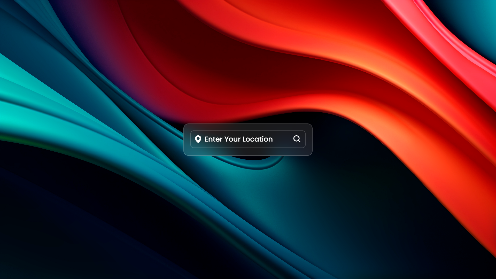
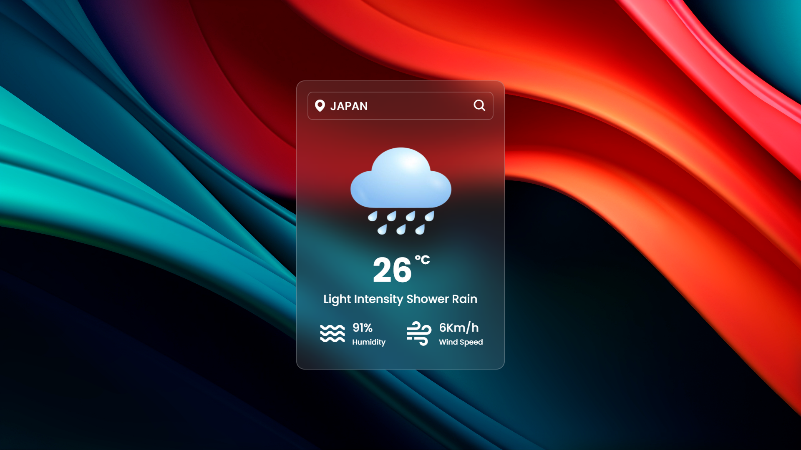
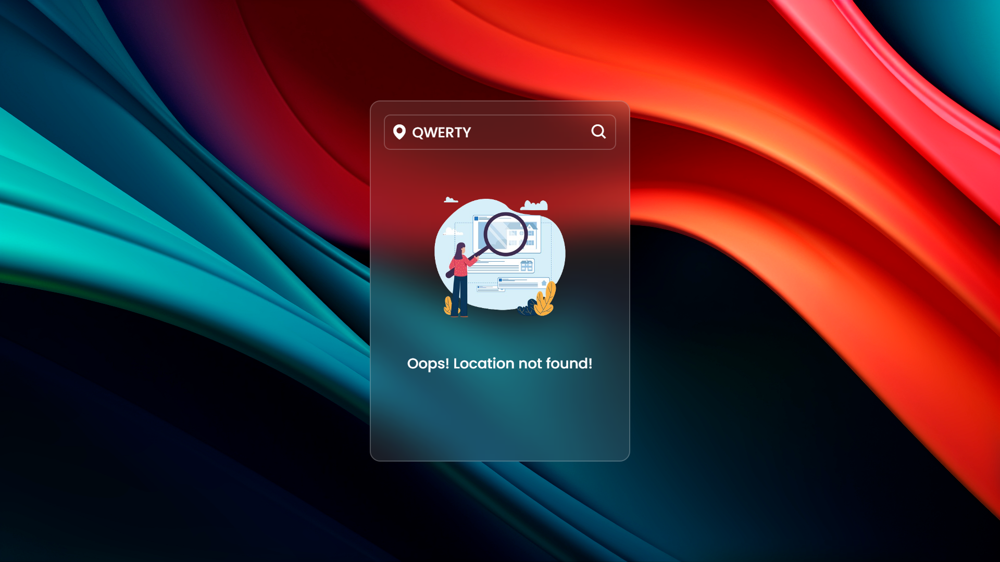

# Weather-app
This is a simple and responsive weather application built using HTML, CSS, and JavaScript. The app allows users to search for current weather conditions in any city around the world. It fetches real-time weather data using an external API and displays information such as temperature, humidity, wind speed, and weather conditions with an icon.

## Features:
+ City Search: Users can enter a city name to get the current weather.
+ Real-Time Data: The app fetches up-to-date weather data from an API.
+ Responsive Design: The layout is fully responsive and works well on different devices.
+ Dynamic Background icons: Background icon changes based on the weather conditions.
+ Error Handling: Displays an error message if the city is not found.

## Screenshots

## Technologies Used:
+ HTML: Structure of the application.
+ CSS: Styling and layout.
+ JavaScript: Fetching data from the API, handling user input, and dynamically updating the UI.

Feel free to explore or use this code as a reference for your own projects!
